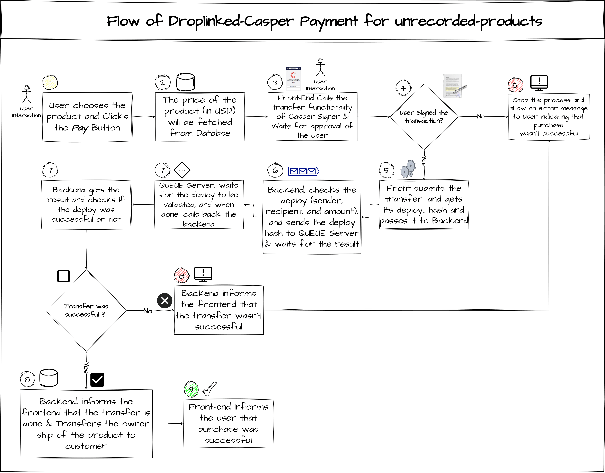

<u>[Droplinked Documentations](README.md)</u> >> Payment System

# <u>Droplinked Payment System</u>

## • <u>Possible Payment Types</u>

<h5>In the above image you can see all the possible payment types. In Droplinked we Implement Payments of type 2,6,7 and 8. 
The other types have logical problems or there is no need for them in Droplinked. 

We use Stripe for payment type 2 & Crypto payment for other types. </h>

## • <u>Payment Process</u>

### - <u>Recordless Payment</u>

### <u>**Note : The flochart below needs to be updated (and soon will be updated), It's temporary!**</u>

### - <u>Recorded Payment</u>

TODO