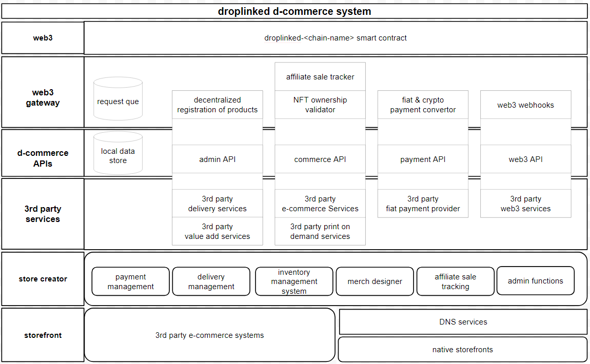

# <u>Droplinked Documentations</u>

## • <u>Table of Contents</u>
<!-- 1. Contract interface (DRC-42)
2. Payment System
3. Decentralization
-->

| **NO.** 	|                      **Title**                      	|                                                **Description**                                               	|
|:-------:	|:---------------------------------------------------:	|:------------------------------------------------------------------------------------------------------------:	|
|    1    	| [Contract interface (DRC-42)](ContractInterface.md) 	|  Droplinked's Smart-Contract Standard Interface Documentation, including Contract Methods & Payment Methods  	|
|    2    	|          [Payment System](PaymentSystem.md)         	| All payment types supported by Droplinked, and their process (Direct Pay, Pay for recorded Product and ...)  	|
|    3    	|       [Decentralization](Decentralization.md)       	|                   The process of decentralizing droplinked's products (Record + Affiliate)                   	|
|    4    	|        [Payment Contract](PaymentContract.md)       	|                    Droplinked's Smart Contract for Handling payments & Transferring tokens                   	|
|    X    	|           [Terminology & Terms](Terms.md)           	|                                 Droplinked Ecosystem's Terminology & Glossary                                	|

### • <u>Droplinked D-Commerce Stack</u>

### • <u>Comming Soon</u>
- [ ] Droplinked's Smart-Contract Standard Interface Documentation update
- [ ] Droplinked Ecosystem's Terminology & Glossary