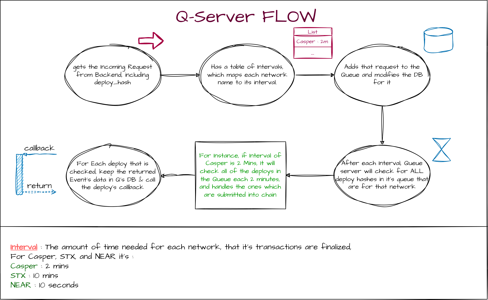

<u>[Droplinked Documentations](README.md)</u> >> QServer

# <u>Droplinked Q-Server</u>
Q-Server (Queue Server) is responsible for all interactions with blockchain on droplinked. It checks the deploys that are sent from our front-end and back-end, and verifys them when theu are submitted, keeps record of contract events, and does callbacks to backend when the status of a deploy is verified. Also, It is responsible for Ruleset-Gating & other APIs that have something to do with Web3. So, It's our gateway to Droplinked's Web3!

## <u>Q-Server Tasks</u>

### 1.Transaction Verification & Event keeping

<u>Q-Server's First task is to verify the transactions of multiple chains, and callback to backend when they are done. Also it keeps record of contract's events (that are raised from these deploys). </u>

The flow of deploy checking is brought in the above diagram. Q-Server must keep a interval table (or map) which maps the Network name to It's `(Interval)`. `(Interval)` is the maximum amount of time that is needed for a transaction to be verified on a chain. for instance, the interval of `<Casper>` is 2 minutes or the interval of `<STX>` is 10 minutes! each time a new deploy comes to Q-server to be checked, you should put it in the queue, and within each interval of each network, you should check all of their deploys that are in the queue and not verified yet! and then q-server waits for another interval, and after that, it would check again, and this goes on for ever. 

<b>Also, keep in mind that these intervals are different for each chain, so for example the Q-server shall check for casper deploys each 2 minutes and for stx deploys each 10 minutes. So you should check for all networks at the same time and wait for each of them different amount of time!</b>

### 2.Ruleset Checking

Q-server must have API endpoints (which could be called only from the verified backends that have API access), to handle ruleset gating for different supported chains.